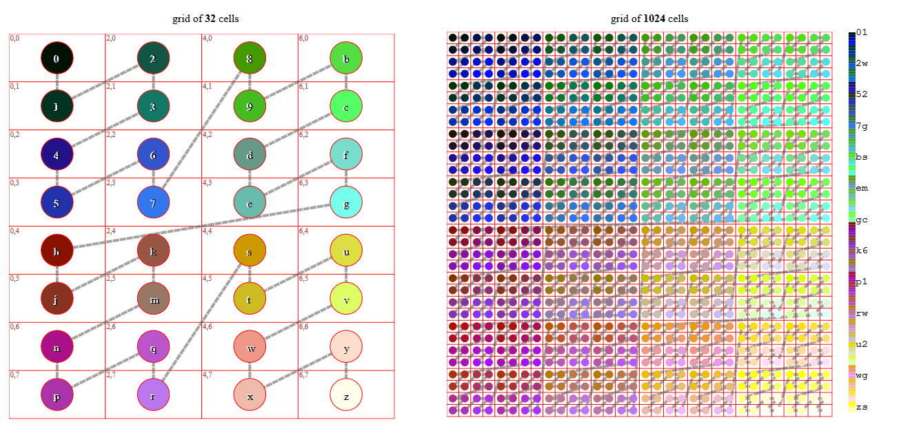

# NearestStateFinder

## Problem Statement
- The main problem in this project was we got a huge dataset. It was easy to count the distance between two distances based on the function. However, it's not that easy to find the 'nearest' one in a short time if we use the travel algorithm which takes O(n). So we decided to use Hash. The hash algorithm is efficient in searching for a specific element.

- To realize the Hash algorithm, we first do the preprocessing of data, using the geoHash algorithm. This algorithm can translate a pair of latitude and longitude into a string and is capable to translate it back to coordinates. (https://en.wikipedia.org/wiki/Geohash)

  hash is very convenient for neighbor searching as it cut the space into continuous pieces and link them together in Z shape. 

- We used the json file to store the dictionaries. To reduce cost and save time, we used a hierarchy structure so that we don't have to load a huge dictionary every time. First, we use the first three letters to create the first level index.
```
2jq.json
2jr.json
2jw.json
...
```
  So we can only load one dictionary json file each time. These files are relatively small compared to a whole json file stores everything.
  
- Inside the JSON file, we build a dictionary in this kind of structure: ```"<geohash code>": "<State> <Province>"```. A good example will be ```"cbj1ky": " MN Wright"``` Once we got the input coordinates and transform them to geohash, it can be easily translated to state and province.
  
- When finding the geohash code in our dictionary, the input point may have no match in our existing database. So we have to use binary search to give it the closest match in our dictionary keys. Fortunately, python supports the comparison between two strings. For example, it can directly tell that cbj1ky is smaller than ```cbj0yj```. Therefore, a standard binary search could be implemented in our case without optimization.

- Additionary, because we need to know the nearest K points (1-10), we changed the search algorithm. After we got the nearest one in index i, we will then return the i-K/2 to i+K/2. This method sometimes causes trouble when the range i-K/2~i+K/2 is located in two or more sub dictionaries. We used the binary search twice, one for sub dictionary search and one for key search, to solve it.

- Another problem is that the dataset had different points with the same state and province names. In the final results, we used the ```set``` to remove all these replicated points.

## Execuating requirements
* python 3.6 or higher
* linux x86-64
* compatiable with node-15.4.0
* internet connection
## How to install

* compile only:
```make all```

* compile and run:
```make run```

## Recalculating GeoHash library
- The first step to run this project will be to unzip the ```NationalFile.tar``` and get the information file of the provinces and states. 
``` 
cd pyscript
python3 textReader.py NationalFile_StateProvinceDecimalLatLong.txt
```

- To run this project, first check if there is a folder called  ```dics``` inside your project file. If not, please run the ```textReader.py``` first to get it. This folder will contains all the hierarchy dictionaries this project will use to do the state:country search. If you run this function, it will take a while so please give it some patience.
- If you want to test if the ```textReader.py``` is totally functional, try to change the text file it reads from ```NationalFile_StateProvinceDecimalLatLong.txt``` to ```partial.txt```.


## Search
### via Terminal
```
cd pyscript
python3 codeHandler.py
```
- After you run the code, you will see
```
Use Please input Latitude and press Enter:
Please input Longitude and press Enter:
Please input how many provinces you want to find near this point:
Do you want to remove the repolicated points in same provinces in the results? (1-yes, 0-no)
```

- Note: In this version, the user interface is ```python3 codeHandler 36.4611122 -109.4784394 6 1```
- Here's an example input and output:
```
The Geohash precision in this project is 6
Please input Latitude and press Enter: 36.4611122
Please input Longitude and press Enter: -109.4784394
Please input how many provinces you want to find near this point: 6
Do you want to remove the repolicated points in same provinces in the results? (1-yes, 0-no) 1
36.4611122 -109.4784394
GeoHash Code: 9w6pkv
The nearest reference point would be in NM San Juan with approximately 64.56301138550664 km distance
The nearest reference point would be in NM McKinley with approximately 136.6712929858626 km distance
This results has removed the replicated points.
```
- You can see the result in ```results.json```

### via Gui


## Technologies
* Vue.js
* Typescript
* Electron
* python3
## TroubleShoot
1. Unable to show the google map.

running the gui program on scc. (google map key limitiation)
